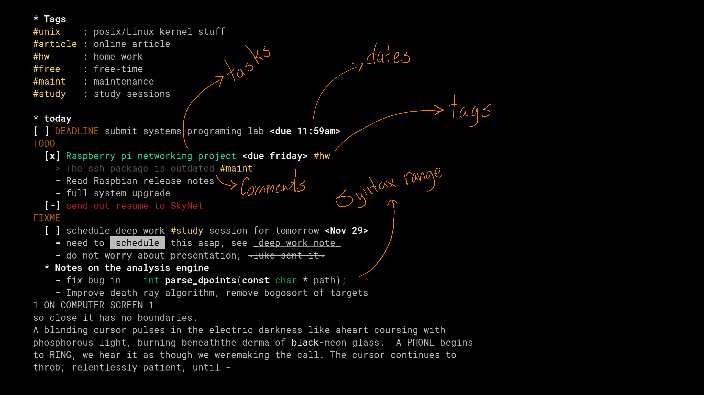
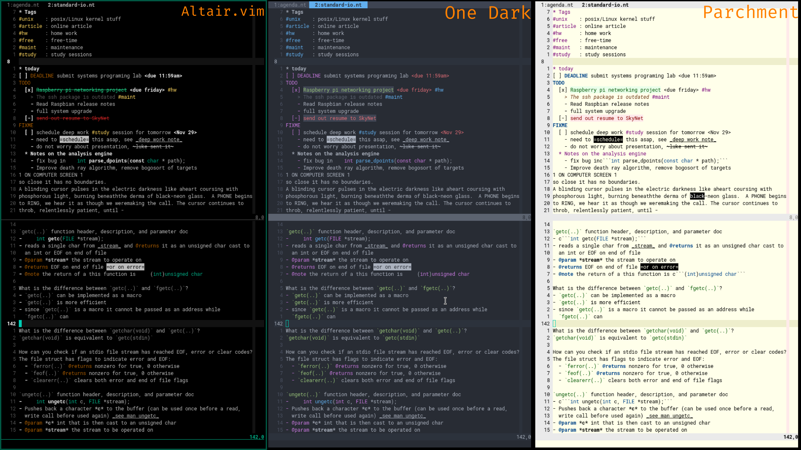

# note.vim
Syntax highlighting for tasks, tags, comments and many more simple 
organizational constructs


After reading [single txt file productivity app](https://jeffhuang.com/productivity_text_file/),
the idea of having a single text file as an organizational system was enticing
since it abides by the [worse is better philosophy](https://en.wikipedia.org/wiki/Worse_is_better)
and because a text file is as versatile as it gets, well except for syntax
highlighting which is the aim of this plugin.


# preview

  - tags can be anywhere, even in comments
  - markup can be anywhere but in comments and headings
  - install [vim syntax range](https://github.com/vim-scripts/SyntaxRange) to
    get nested code highlighting
    > `` c```some stuff in c``` `` is the syntax in the upper image, the delimiters
    > are hidden



Colors from left to right:
  - [Altair.vim](https://github.com/ysftaha/altair.vim)
  - [vim-one](https://github.com/rakr/vim-one)
  - [parchment](https://github.com/ajgrf/parchment)

It looks good on most themes, usually `:set termguicolors` allows for a better
color range

# Installation and Usage
Add the following to your .vimrc, for *vim-plug* :

```sh
Plug 'ysftaha/note.vim'
```

Or however your plugin manager handles them :)

You can also clone this to your plugins directory

# License
[people actually read this?](LICENSE.txt)
